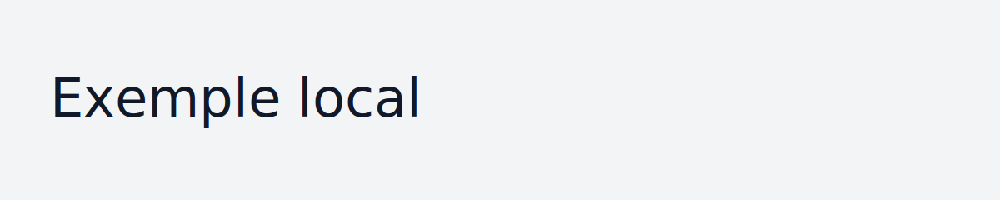

# Plan de cours — exemple local

Ce dossier simule un *repository* local (dans ce dépôt) qui contient un plan de cours en Markdown.

- Il sert à valider que le pipeline de cache + preprocessing fonctionne aussi avec des sources locales.
- Il peut contenir des images relatives, qui doivent être copiées dans le cache.

## Présentation du cours

### Description du cours

Ceci est un exemple local pour tester le flux de mise en cache.

### Objectif intégrateur

Valider le pipeline local.

### Compétence(s) ministérielle(s)

- 015U Réaliser un produit multimédia sur support.

### Objectifs d'apprentissage

- Tester la mise en cache.
- Tester la copie d’images.

### Cours liés

Préalables absolus

- 420 V11 MO Programmation interactive

